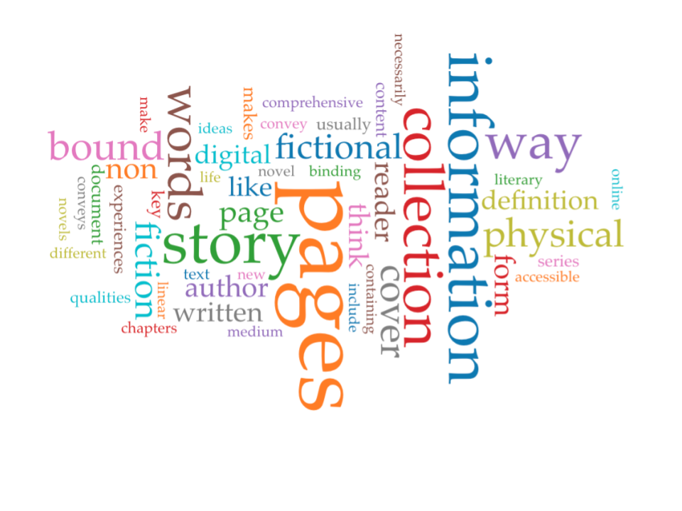

# Defining the Book in the Digital Age

Defining the book in the digital age, or in any age, is a challenging endeavour.  “The book” has meant many things to many people throughout history. This project, which derives often contradictory definitions by randomly combining a finite set of variables, is meant to reflect those different meanings, and place them on the level playing field of digital randomization. This will hopefully encourage the viewer to examine their assumptions in their historical context, and incite the viewer to engage in and explore the challenges which arise. 
To create my program, I chose to create five variables, answering five key questions, which would form my rudimentary definition. Each variable contains a list of words or phrases (which I will call “segments”), one of which the program will randomly pull every time it runs. To fill my lists ([visible here](https://github.com/zoe-f-cyborg/definition_of_a_book_project/blob/main/list.md)), I chose to examine the forum posts defining the book which my peers and I posted in week 2 of this course (White) expanding on them based on things we learned later on. 

## Question 1: What is a book? 

This question is the broadest and most basic one we will deal with, thus the most challenging to turn into a succinct list. Excluding elements which will be addressed later, such as purpose and maker, the forum posts for this question discussed mainly physical characteristics, content, and access. Below is a [word cloud](link) generated in [Voyant](https://voyant-tools.org/?corpus=48b402d2486d6d4613d3b443ca329a62) showing the words which were most frequently used in our definitions.

The most frequent word, with 18 mentions, was “pages.” In addition, descriptions of those pages as being “bound” and having a “cover” were also common. Many people felt the need to include these material characteristics in their definition, but often with the caveat that these characteristics may or may not be “physical,” i.e. that they may be paper or displayed on some type of digital screen. This accounts for many of the instances when the word “physical” was used. Students were keenly aware of the challenges of defining the book according to its physical characteristics. “I've been struggling with this!” one student said. “Are we defining physical characteristics of a book, or what content makes a book?”

Indeed, many students did discuss content in their definitions. Words like “information,” “collection,” “words,” “fiction,” and “story” show the range of content that we imagined books to have. Some of us were clearly thinking mostly about the novel, for example the student who defined a book as “more than 80 pages (less than that is a novella)” and stated that “it should include a beginning, middle and end.” However, some were thinking very broadly about the book, challenging the ideas of other students. Many discussed “information” instead of story, highlighting how books have been not just a means of sharing fiction but of conveying and preserving matters of fact. One commenter said that books and novels differ  “because novels are plot driven, but books don't have to be.” Another even said that a book “doesn't necessarily have to have words within it,” that is, that a book of pictures is still a book. 

Finally, many touched on the issue of accessibility as it relates to the book. Two students mentioned accessibility, one in relation to material, the other to content. One said that a book’s content is “bound in a singular, widely accessible, and portable medium.” The other said that a book “conveys a comprehensive meaning or plot that is easily accessible to all readers.” It is unclear to what degree many of these descriptions were aspirational rather than actual. Obviously not all books can be accessible to all readers. People speak different languages, but they also have different levels of expertise. If every physics textbook had to explain what atoms are, it would be difficult to build up a collection of human knowledge. Regardless, these comments demonstrate an interest in access, who has it and who doesn’t. 
Although many of these definitions were complex and thoughtful, they often lacked historical insight. Students thought deeply about the tension between the physical codex and the material e-book, but they were not thinking about the medieval manuscript. For example, one student included portability as a characteristic of the book. This is a characteristic that most modern paperbacks and ebooks share, however, it is not shared with the heavy, unwieldy, and expensive volumes of medieval [chained libraries](https://medievalfragments.wordpress.com/2013/05/10/the-last-of-the-great-chained-libraries/). In addition, many of us thought about accessibility, but few with a historical insight into how access to books and book making materials has always been limited. The idea of the book as widely accessible has only become ubiquitous with the rise of the mass market paperback, due in part to the United State’s refusal to enter into international copyright agreements around the end of the 19th century (Striphas, 32). Before this, and certainly before the invention of the printing press, books were an expensive luxury. In the middle ages, they were not vectors for mass entertainment but almost exclusively for scripture (Encyclopedia Britannica, “The revival of the secular book trade”). 

## Question 2: Who makes it? 
This question was meant to allow us to examine the notion of authorship, and who exactly can be credited with “making” a book. Beginning arguably in the 14th century with Vasari’s [**Lives of the Most Eminent Painters, Sculptors, and Architects**](https://www.britannica.com/biography/Giorgio-Vasari#ref37617) (Encyclopaedia Britannica) and continuing through to the present day, we have an idea of “the artist” as an isolated individual. This idea is reflected in the student mentions of authorship. Of the four mentions of “author,” only one included and “(s)” to indicate the potential for multiple authors. Another used the term “a writer,” while one more said a book was “attributable to a specific person or persons.” Books, in this view, may be conceived of as glimpses into the mind of a (usually singular) author. They represent a “cohesive” or “comprehensive” (other words which popped up in the word cloud) vision. This explains the claim which one student made that “a book is someone's world... it transports one into the mind or experiences of another.” 

Of course, this idea of the artist overlooks all of the other people involved in book production. In the modern publishing industry, there are not only authors but editors, designers, publicists, and legal consultation. There are also people who design and operate the printing equipment. In early book publishing, although the operation was often smaller, there would have been “bulls” pulling the presses in printing houses, as well as papermakers and bookbinders (EB, “The age of early printing”). For this list, I included some of the individuals who might claim to have made the book, such as “publicist” and “printer” and “editor,” and also “a team of collaborators.” Although this last answer may seem most “correct,” none of the others are actually wrong, but merely highlight different aspects of book production. It is my hope that by bringing each of these individual elements to the viewer’s attention, it will incite them to think more about how that specific role plays into the overall idea of “a book.” 

## Question 3: How is it made? I.e., what tools are used and where? 

This question is not really reflected in the forum posts. One student did comment that a book “is printed on paper rather than something like papyrus,” however other than that, minimal reference was made to the manufacturing of books. I still wanted to include this variable in the project because there have been so many different eras book production has gone through, and so many different approaches to their physical construction. There have been monks in scriptoriums copying texts and designs onto vellum, there have been printing presses and font faces, there have been laser printers and word processors. I felt the need to include one variable which could represent briefly a few of those different material production methods. 

## Question 4: How is it read?

This is a very interesting question which a few of the students at the beginning of the course engaged in, explicitly or implicitly. Specifically, we explored whether the reading of a book is linear or nonlinear, silent or out loud, public or private, and close or distant. One student defined the book as a “document that can be read in both a linear (from front to back) and / or non-linear (starting to read at any point within the document) fashion.” This is a very cogent point which Stallybrass defends when he argues that the indexical, almost hypertextual nature of the codex, the fact that one can flip quickly between different points unlike with a scroll, contributed to the development of Christianity (42-74). Modern readers may have a tendency to think that the proper way to read a book is linear, but these accounts suggest that in fact, the exact opposite is true. When reading a book with footnotes, I can almost instantaneously flip back and forth from my chapter to the back of the book, just as I can click the link in a wikipedia article. Books have the unique advantage of being very easy to read in a nonlinear fashion. 

One student also mentioned the potential for auditory reading, saying that books can be in “audio form.” There is more historical precedent for this than the student likely realized. One academic argues that it was only “in the late seventeenth and early eighteenth centuries” that silent reading truly began to emerge in England (Jajdelska 4). Before this, reading aloud was the norm, and those who read silently were considered rather odd, for example in [Augustine’s account of observing Ambrose read without moving his lips](https://web.stanford.edu/class/history34q/readings/Manguel/Silent_Readers.html). This transition from reading aloud to reading silently brought with it the distinction between reading publicly and reading privately. Although reading aloud was not necessarily public-- often people read aloud to themselves, or only to intimate companions (Jajdelska  37)-- this new widespread silent reading practice did bring with it changes in the form of the book. Diaries, for example, became less public informational documents and instead “created a relationship with an implied reader in an intimate and confidential setting” (165). This supports the notion that we discussed in Question 2, of the book as something which “transports one into the mind or experiences of another.”

This isn’t to say that reading nowadays is always private, silent, or nonlinear. The existence of book clubs, bookshelves where people display their books, and websites like Goodreads testify that there is still a large public component to book reading, that reading is “promiscuous, networked, and above all social” (Nakamura 242). The increasing popularity of audiobooks indicates that the book as an auditory form may also be making a comeback. And the practice of reading aloud may challenge the notion of the book as nonlinear and hypertextual, since an audiobook is more like a scroll in that it is difficult to flip through. These historically rooted reading conventions of reading are all, therefore, under scrutiny in the digital age. 

Another historical reading convention which the digital age challenges is that of close reading. Close reading, the process of sitting down with a small corpus and picking it apart, is the only form of reading widely accepted in academic circles as intellectually legitimate (Hayles 63-64). However, it is by its nature exclusive, requiring a small canon of texts, and therefore has the potential to overlook major sources of knowledge (Moretti “Distant Reading”). 20 years ago, the idea of “distant reading” was introduced by Franco Moretti as a potential solution to this problem. He suggested that we ought to pursue methods of reading which bring us more general knowledge about a much larger corpus, rather than a lot of knowledge about a small one. Tools like [Voyant](https://en.wikipedia.org/wiki/Voyant_Tools) and [AntConc](http://edutechwiki.unige.ch/en/AntConc) can provide valuable assistance with this task, giving us a sort of digital summary of texts we would never have the time to read closely first-hand. In addition to distant reading, computers also assist us in hyperreading, a method of reading which most people who spend any time online will be familiar with. This is the sometimes distracted, fragmentary, and fast-paced type of reading that the internet is built for, including things like skimming, scanning, and keyword searches (Hayles 66-67). Ebooks allow us to apply this style of reading to the book. If you’re ever used control+F to find a quote you like in an ebook, you have engaged in hyperreading of that book. 

## Question 5: What is its purpose? 

Here there were a variety of perspectives. As already discussed, many identified the purpose of a book as telling a story, exploring another person’s mind, or transmitting information. Another purpose which was hinted at was the idea that the purpose of a book is to make money. One student defined the books as having “an eye-catching cover.” This is another definition which betrays its historical limitations, since medieval codices often didn’t have identifying or attention-grabbing covers. In the early ages of printing and manuscript making, books were usually commissioned, not printed and then sold, so covers were unnecessary. In either instance however, there was clearly a profit motive involved. Books exist, at least in part, to make people money. 

Books can also be a means of education and a demonstration of wealth. One student describes the purpose of the book optimistically as designed to “educate, provoke deeper thought and provide new understanding.” But what exactly are people being educated in when they read? Striphas suggests that one purpose of the book historically is to “to rehearse and refine” (31) the skills of middle class life. In addition, Striphas touches on the public and performative aspect of book-buying when he describes the history of bookbacks, fake books which people bought to fill their book shelves (28). Books in this view are “meant to be accumulated and displayed,” (31) they exist to signal one’s wealth and education. These less pleasant and idealistic ideas of a book’s purpose were largely absent from the forum posts.

## Works Cited

Jajdelska, Elspeth. Silent Reading and the Birth of the Narrator, University of Toronto Press, 2007. ProQuest Ebook Central, http://ebookcentral.proquest.com/lib/oculcarleton-ebooks/detail.action?docID=4672359. 

Manguel, Alberto. “Chapter 2: The Silent Readers.” A History of Reading, New York: Viking, 1996, https://web.stanford.edu/class/history34q/readings/Manguel/Silent_Readers.html. Accessed Dec 5 2020. 

Moretti, Franco. “Conjectures On World Literature.” New Left Review, vol 1, no. 1, Jan/Feb 2000, https://newleftreview.org/issues/ii1/articles/franco-moretti-conjectures-on-world-literature. Accessed Dec 5 2020. 

Nakamura, Lisa. “‘Words with Friends’: Socially Networked Reading on Goodreads.” PMLA, vol 128, no. 1, Jan 2013, https://doi.org/10.1632/pmla.2013.128.1.238. 

Stallybrass, Peter. “Chapter 2: Books and Scrolls.” Books and Readers in Early Modern England: Material Studies, edited by Jennifer Andersen, and Elizabeth Sauer, University of Pennsylvania Press, 2001. ProQuest Ebook Central, https://ebookcentral-proquest-com.proxy.library.carleton.ca/lib/oculcarleton-ebooks/detail.action?docID=3441724.

Striphas, Ted. “1 E-Books and the Digital Future.” The Late Age of Print: Everyday Book Culture from Consumerism to Control, New York: Columbia University Press, 2009. 

Unwin, George. History of publishing. Encyclopædia Britannica, October 1 2020, https://www.britannica.com/topic/publishing. Accessed December 5 2020. 

Weston, Jenny. “The Last of the Great Chained Libraries.” medievalfragments, May 10 2020, https://medievalfragments.wordpress.com/2013/05/10/the-last-of-the-great-chained-libraries/

White, Michelin, et al. “DO: Post an Answer: What is a Book? Group A.” Culearn. September 17 2020. Accessed Dec 3rd 2020. https://culearn.carleton.ca/moodle/mod/forum/discuss.php?d=568609. Accessed Dec 5 2020.

White, Michelin, et al. “DO: Post an Answer: What is a Book? Group B.” Culearn. September 17 2020. Accessed Dec 3rd 2020. https://culearn.carleton.ca/moodle/mod/forum/discuss.php?d=568597. Accessed Dec 5 2020.
